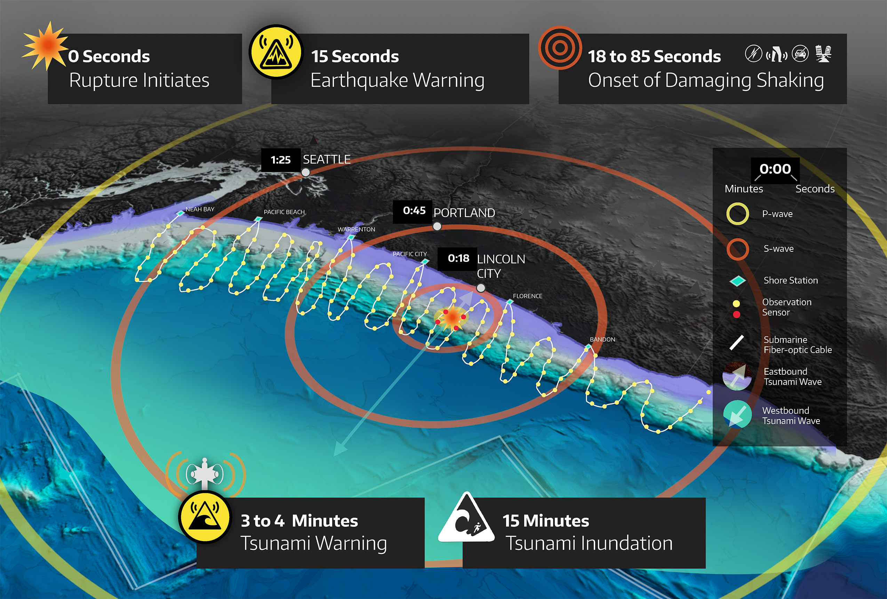
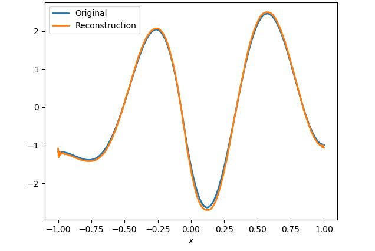
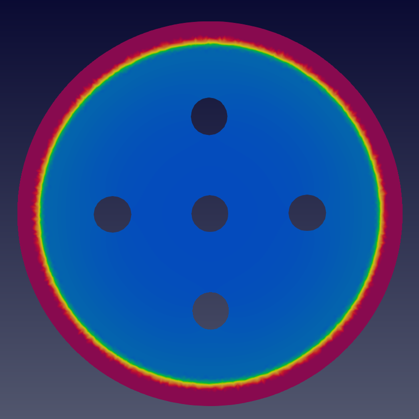
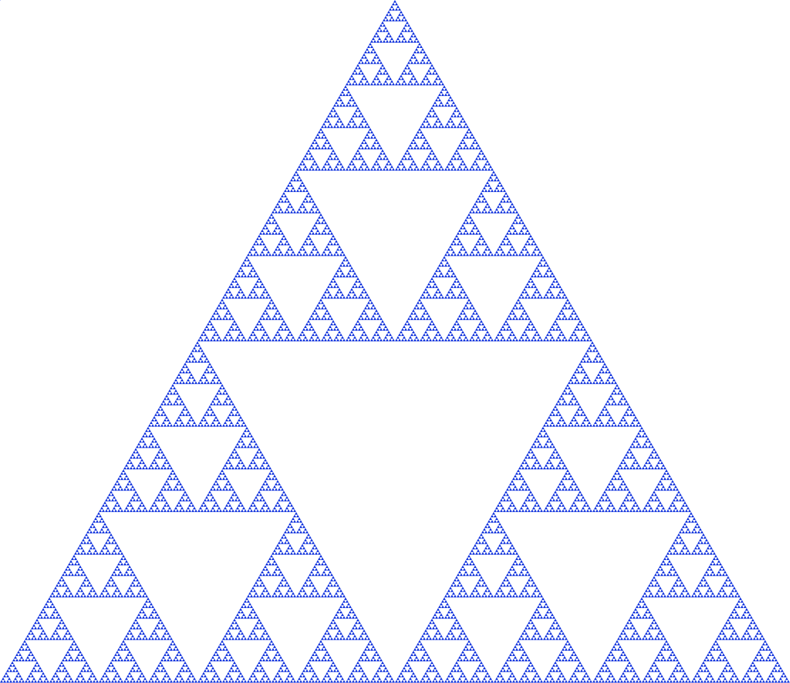

## Publications

::: {#refs}
:::

## OPTIMUS (Oden Institute)

[{.lightbox .research-img}](http://cascadiaoffshore.org/story/White_Paper.html)

Tsunamis resulting from megathrust earthquakes have taken the lives of millions and caused hundreds of billions of dollars in damages. To prevent such destruction by future tsunamis, authorities plan to install acoustic pressure sensors on the seafloor to act as an early-warning system. At the core of designing such an early-warning system lies the ability to — in real-time — infer the spatiotemporal seafloor deformation from the pressure data and use the inferred deformation to predict the trajectory of a potential tsunami. To this end, we aim to create a digital twin for the Cascadia subduction zone, one of the targeted regions for installing seafloor pressure sensors. The digital twins we target have the following properties: (1) they employ discretizations of high-fidelity PDEs, leading to extreme scale forward problems; (2) they solve an inverse problem to assimilate observational data to infer uncertain model components followed by a forward prediction of the evolving dynamics; (3) the entire end-to-end data-to-inference-to-prediction computation is carried out in real-time through a Bayesian framework that rigorously accounts for uncertainties.

Creating digital twins with the above properties is challenging due to the enormous size and complexity of the high-fidelity models. For example, a reasonable discretization of the Cascadia subduction zone gives rise to a system with $\mathcal{O}(10^{10})$ parameters and a formal flop count of $\mathcal{O}(10^{30})$! Developing accurate and predictive surrogates over a $10^{10}$-dimensional parameter space for tsunami dynamics described by hyperbolic PDEs is seemingly intractable as the PDEs do not admit low-dimensional subspace representations. However, we can circumvent these challenges by exploiting the intrinsic structure of the problem. Namely, our methodology (1) exploits the time shift-invariance of autonomous dynamical systems to reduce the required number of adjoint wave propagations from $10^5$ to 100; (2) uses the same property to extract the block Toeplitz structure of the parameter-to-observable (p2o) map; (3) employs FFTs to diagonalize the p2o map; (4) constructs the inverse operator, and thus the posterior precision operator, in the data space rather than the parameter space; (5) decomposes the computation into a more expensive offline phase (done once) and an online phase of inference and prediction that executes in a few seconds; and (6) designs all underlying algorithms to maximize locality, arithmetic intensity, and communication efficiency to run and scale well on large GPU clusters. The result is a framework for extreme-scale, high-fidelity Bayesian inference and posterior prediction in real-time, with application to tsunami early warning.

## Los Alamos National Laboratory XCP Summer Workshop (2021)

In the summer of 2021, I worked with researchers Dr. Bertrand Rouet-Leduc and Christopher Ren at LANL to study Generative Adversarial Networks (GANs) for generating synthetic InSAR data to be used in training denoising networks. In particular, we considered several GAN architectures including Wasserstein GANs and Cycle GANs. More details available upon request.

## NSF Randomized Numerical Analysis RTG (2018-2021)

{.lightbox .research-img}

At NC State, I worked with Dr. Ralph Smith and Dr. Tim Kelley as part of the NSF RTG on Randomized Numerical Analysis to study reduced-order models that obey conservation laws. In the construction of reduced-order models for dynamical systems, linear projection methods, such as proper orthogonal decompositions, are commonly employed. However, for many dynamical systems, the lower dimensional representation of the state space can most accurately be described by a *nonlinear* manifold. Previous research has shown that deep learning can provide an efficient method for performing nonlinear dimension reduction, though they are dependent on the availability of training data and are often problem-specific. Here, we utilized randomized training data to create and train convolutional autoencoders to perform nonlinear dimension reduction for the wave and Kuramoto-Shivasinsky equations. Moreover, we presented training methods that are independent of full-order model samples and use the manifold least-squares Petrov-Galerkin projection method to define a reduced-order model for the heat, wave, and Kuramoto-Shivasinsky equations using the same autoencoder.

## UCLA Computational and Applied Mathematics REU (2020)

{.lightbox .research-img}

I worked with Dr. Andrea Bertozzi, Dr. Weiqi Chu, and Dr. Wen Li to study phase separation and volume expansion in lithium-ion batteries. Specifically, we wanted to determine how the addition of nanopores in a silicon-based anode would affect the mechanical stress and strains underwent by the battery during the charging-discharging process. While working on this project, I spoke with several experts in math modeling, chemistry, and engineering to better understand the physical context of the problem and develop new methods for analyzing the system. By the end of the project, I was able to create a finite-element solver for fourth-order, nonlinear, time-dependent system of PDEs that was used to model the system on a two-dimensional domain with and without pores and plot hysteresis loops to determine that the addition of nanopores increases the mechanical stability of the batteries over time.

## Cornell Summer Program for Undergraduate Research (2019)

{.lightbox .research-img}

In the summer of 2019, I participated in the Cornell Math Summer Program for Undergraduate Research (SPUR), where I worked with Dr. Robert Strichartz and Dr. Kasso Okoudjou to study orthogonal polynomials on fractals. Through the course of this project, I was able to derive recurrence relations for Sobolev Orthogonal Polynomials on the Sierpinski Gasket and create a comprehensive software package in Python that was used to study the properties of these polynomials and enable fast numerical implementations of the results. During the final weeks of the project, I also studied how we can use these orthogonal polynomials to compute quadrature and interpolation rules on fractals. I presented the SPUR work at several conferences — including the Young Mathematicians Conference 2019 and Joint Mathematics Meeting 2020 — and on the SPUR [website](https://e.math.cornell.edu/sites/op_on_sg/html/). Furthermore, I continued to polish and compile the results from the project, and have submitted the paper for publication in the *Journal of Fourier Analysis and Applications*.